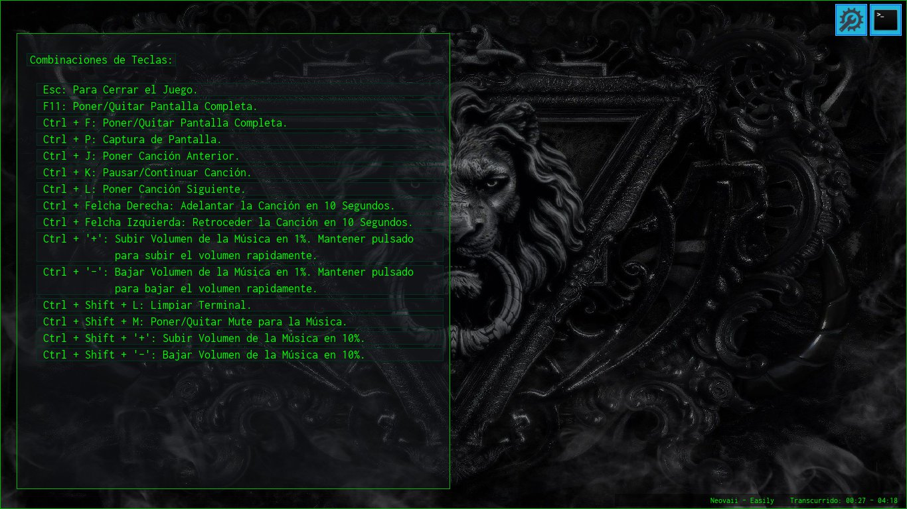
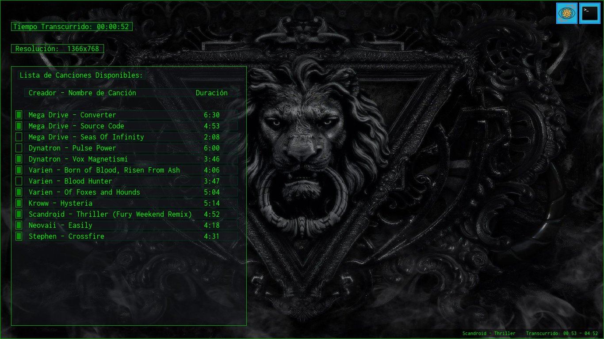

# Odyssey in Dystopia. v1.1.7

## Juego emulador de consola de comandos.

### Sinopsis:

En esta simulación se pretende crear un entorno en el cual el jugador pretender ser un personaje el cual no recuerda quién es ni porque se encuentra en dicho lugar llamado Dystopia, en donde le obligan a hacer una serie de tareas como si de un Hacker profesional se tratará, sin recuerdos ni salida se verá obligado a obedecer a Dystopia, que no es más que una organización que ha creado una super red de nombre homónimo a escala mundial intentando suplantar el internet el cual esta en decadencia. La finalidad de Dystopia es que su caótico sistema (donde solo ellos realmente saben lo que hacen) puedan hacer lo que quieran con la información, con fines delictivos y destructivos, haciendo creer al mundo entero que ellos son la solución a la decadencia del Internet. Con el paso del tiempo, comenzará el jugador a descubrir que es lo que hace ahí y porqué, en donde se dará cuenta de una terrible realidad que lo obligará a hacer cosas para mejorar su situación y salir de aquel lugar.

### Desarrollo:
Atualmente este proyecto se encuentra en fase de Desarrollo, con la implementación de la consola y comandos limitados, aún no se implementa el sistema de semilla y misiones.

### Combinación de Teclas Disponibles:

* __Esc__: Para Cerrar el Juego.
* __F11__: Poner/Quitar Pantalla Completa.
* __Ctrl + F__: Poner/Quitar Pantalla Completa.
* __Ctrl + P__: Captura de Pantalla.
* __Ctrl + J__: Poner Canción Anterior.
* __Ctrl + K__: Pausar/Continuar Canción.
* __Ctrl + L__: Poner Canción Siguiente.
* __Ctrl + Felcha Derecha__: Adelantar la Canción en 10 Segundos.
* __Ctrl + Felcha Izquierda__: Retroceder la Canción en 10 Segundos.
* __Ctrl + '+'__: Subir Volumen de la Música en 1%.
    Puede mantenerse pulsado para subir el volumen rapidamente.
* __Ctrl + '-'__: Bajar Volumen de la Música en 1%.
    Puede mantenerse pulsado para bajar el volumen rapidamente.
* __Ctrl + Shift + L__: Limpiar Terminal.
* __Ctrl + Shift + M__: Poner/Quitar Mute para la Música.
* __Ctrl + Shift + '+'__: Subir Volumen de la Música en 10%.
* __Ctrl + Shift + '-'__: Bajar Volumen de la Música en 10%.

### Lista de Canciones de Fondo:

|                  Canción                  | Duración |
|-------------------------------------------| :------: |
| Mega Drive: Converter                     |   6:30   |
| Mega Drive - Source Code                  |   4:53   |
| Mega Drive - Seas Of Infinity             |   2:08   |
| Dynatron - Pulse Power                    |   6:00   |
| Dynatron - Vox Magnetismi                 |   3:46   |
| Varien - Born of Blood, Risen From Ash    |   4:06   |
| Varien - Blood Hunter                     |   3:47   |
| Varien - Of Foxes and Hounds              |   5:04   |
| Kroww - Hysteria                          |   5:14   |
| Scandroid - Thriller (Fury Weekend Remix) |   4:52   |
| Neovaii - Easily                          |   4:18   |
| Stephen - Crossfire                       |   4:31   |

