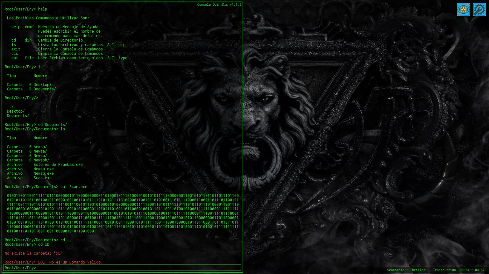

# HackGame

Juego emulador de consola de comandos.

Sinapsis. En esta simulación se pretende crear un entorno en el cual el jugador pretender ser un personaje el cual no recuerda quién es ni porque se encuentra en dicho lugar llamado Dystopia, en donde le obligan a hacer una serie de tareas como si de un Hacker profesional se tratará, sin recuerdos ni salida se verá obligado a obedecer a Dystopia, que no es más que una organización que a creado una super red de nombre omónimo a escala mundial intentando suplantar al internet el cual esta en decadencia. La finalidad de Dystopia es que su caótico sistema (donde solo ellos realmente saben lo que hacen) puedan hacer lo que quieran con la información, con fines delictivos y destructivos, haciendo creer al mundo entero que ellos son la solución a la decadencia del Internet. Con el paso dle tiempo, comenzará el jugador a descubrir que es lo que hace ahí y porqué, en donde se dará cuenta de una terrible realidad que lo obligará a hacer cosas para mejorar su situación y salir de aquel lugar.

